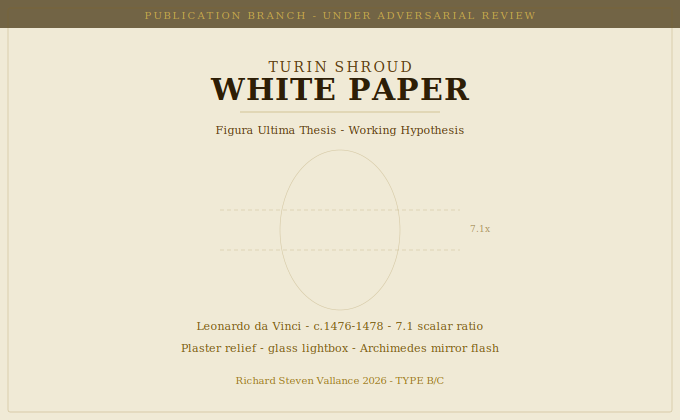

# Turin Shroud White Paper

## Publication Branch — Reserved for Future Controlled-Hypothesis Document

**Author:** Richard Steven Vallance (Da Valenca)
**Parent Ecosystem:** [da-vinci-ultimatium](https://github.com/richievallance/da-vinci-ultimatium)
**Experimental Substrate:** [figura-ultima](https://github.com/richievallance/figura-ultima)
**Constitutional Classification:** Publication Branch
**Publication Status:** 🔴 Not Yet Publication-Ready — Rebuild Required
**DOI Status:** No DOI. No release. Do not cite.

---

## ⚠ Current Repository Status

This repository **is not yet a publication**. It currently contains 23 raw experimental Mechanism chapter files (A–Y) that were deposited here incorrectly during an earlier phase. These files have been relocated to [figura-ultima/experimental_mechanisms/](https://github.com/richievallance/figura-ultima/tree/main/experimental_mechanisms) where they properly belong.

**This repository must be rebuilt from scratch** before it constitutes a valid publication-branch white paper.

---

## What This Repository Is For

This repository is reserved for a future **unified, controlled-hypothesis publication** on the Shroud question. When complete, it will contain:

- A single coherent white paper (not scattered chapter fragments)
- Controlled hypotheses only — no speculative material
- Full constitutional evidence classification (TYPE A/B only)
- Adversarial review notice
- Proper CITATION.cff, LICENSE, metadata.json, and zenodo.json
- DOI upon formal release

---

## Source Material

The publication will draw from selected sections of the [figura-ultima](https://github.com/richievallance/figura-ultima) full thesis. Sections appropriate for controlled publication:

| Section | Content | Evidence Type |
|---|---|---|
| Chapter 1 (adapted) | Core hypothesis — stated as working hypothesis | TYPE C |
| Chapter 6 | 7.1 scalar ratio mathematical argument | TYPE B |
| Chapter 7 | Second layer — blood evidence, STURP citations | TYPE B |
| Chapter 10 | DNA falsifiability pathway | TYPE C |
| Chapter 12 | Counterarguments and scholarly responses | TYPE B |

Sections remaining in figura-ultima only (too speculative for publication branch):
- Chapter 3 — Fraud Question / Theological Position
- Chapter 9 — Exile, East, Provenance Chain
- Chapter 11 — Figura Ultima (most assertive chapter)

---

## Build Schedule

This publication has not been scheduled for release. It will be built when:

1. The figura-ultima full thesis passes adversarial review
2. A controlled-hypothesis structure is formally approved
3. The 7.1 scalar ratio is independently verified
4. The photothermal mechanism hypothesis is formally reviewed

---

## Legal Notice

© 2026 Richard Steven Vallance. All Intellectual Property and Copyright Reserved.
*Da Valenca — Leonardo Project, United Kingdom*
